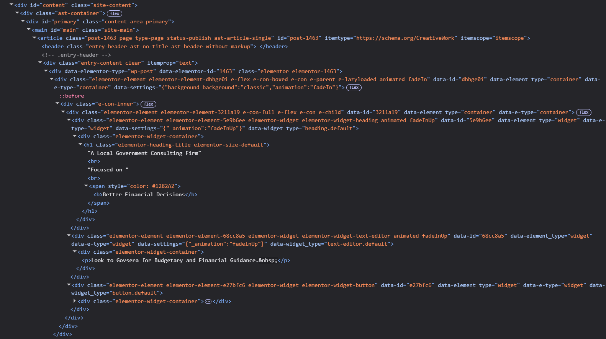

<h1>Front-End Website Development — Structured UI Implementation</h1>

<h2>Description</h2>
This project documents the front-end structure of a business website built with WordPress and Elementor. The focus was on page structure, layout, responsive behavior, and clear content hierarchy.

> ⚠️ **Note:** For simplicity, this case study focuses on the homepage and selected areas of analysis.

[View homepage screenshot](homepage.png)

<h2>Languages and Utilities Used</h2>
<ul>
<li>HTML structure</li>  
<li>CSS layout and styling </li>   
<li>JavaScript basics </li>  
<li>WordPress / Elementor </li>  
</ul>

<h2>Environments Used</h2>
<ul>
<li>Web Browsers (Chrome DevTools)  </li> 
<li>WordPress CMS </li> 
  </ul>

<h2>Project Overview</h2>
<ul>
<li>Semantic structure and content hierarchy</li>  
<li>Layout system implementation</li>    
<li>Responsive design adjustments</li>    
<li>UI/UX principles and refinement </li>   
<li>Visual consistency and branding  </li>  
</ul>

<h2>Semantic Structure & Content Hierarchy</h2>

The homepage hero section was used as an example and reviewed in Chrome DevTools to analyze how the content is structured in the DOM.
  
> DOM stands for Document Object Model.
 
The hero section follows a clear content flow:

<ul>
<li>Primary headline</li>
<li>Supporting text</li>
<li>Call-to-action</li>
</ul>

<h4>Key HTML Structure Reviewed</h4>
<ul>
<li>&lt;main id="main" class="site-main"&gt;- Contains the primary page content</li>
<li>&lt;article class="page"&gt;- Wraps the page content inside the CMS structure</li> 
<li>&lt;div class="elementor-element ... e-con ..."&gt;- Used by Elementor for layout, spacing, and responsiveness</li> 
<li>&lt;h1 class="elementor-heading-title"&gt;- Establishes the main page message</li>
<li>&lt;span style="color: #1282A2"&gt;- Adds visual emphasis inside the heading.</li>
<li>&lt;p&gt;- Provides supporting text.</li>
<li>&lt;elementor-widget-button&gt;- Creates the call-to-action area.</li>

</ul>
<h4>Case Study Note</h4>

Because the page is built with WordPress and Elementor, much of the layout is generated through container-based &lt;div&gt; elements. These containers handle spacing, alignment, animation, and responsive behavior.

The important takeaway is that the visible content still follows a logical hierarchy: headline first, supporting message second, and call-to-action last. This improves readability, scanning, and user flow.

 
  

  
> DevTools view of the homepage hero section showing the main content container, heading structure, supporting text, and Elementor layout containers.
